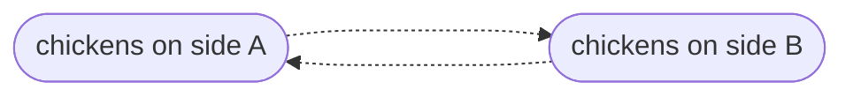
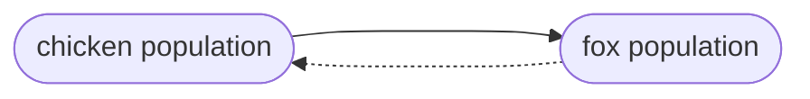

# Introduction
To start analyzing your stories, click Create a new observation from an expanded story, or directly in the database view

n.b.: each observation is specific to a story. Please do not re-use existing observations; always create a new one.

Each new observation will automatically be linked to the text of the story that was open when you created it.

An observation consists of an upstream “from” variable, a downstream “to” variable, and a “label” describing its direction.

It may be helpful to think of “from” and “to” as equivalent to “cause” and “effect."

Variables should ideally have a subject. This is the entity to which the experience, quantity, or quality expressed by the variable belongs.

Subjects do not have to be people; if you need to express interactions between organizations, systems, or the natural environment, you can always add them as additional subjects from this screen or on the subjects tab.

Unlike observations, you can and should re-use existing variables if they fit your needs. Read the full name of the variable to make sure it is appropriate. If not, create a new one using the closest existing one as a reference.

The Variables tab contains a list of existing variables. 

Refer to this to get a sense of proper variable structure.

New variables can be created from the variable selector in an expanded observation, or from the Variables tab.

Every variable starts with a core variable. This is a noun that expresses a quantity or quality that varies in your story.

You can search through the list if you have a sense of what you’re looking for.

Within AESOP, some general words have specific meanings. For example, “ability” and “capacity” refer to different kinds of capability.

When in doubt, check the Reference: Variables tab for a more detailed explanation.

Once you’ve chosen an appropriate noun, use the Predicate, Case, Who, Where, and When fields to finish describing the variable.

Hover over the small “i” icon to the right of each field’s name for a description of what information to put there.

You do not need to alter the Preposition and Description fields—these are automatically computed for you as you fill in the other fields.

The Label indicates the direction of the interaction you are describing. 
+ "+" indicates that the From variable INCREASES the To variable, whereas
- "-" indicates that the From variable DECREASES the To variable  

An observation is valid once you have selected a From variable, a To variable, and a Label. 

Once all three exist, the name of the observation will change to a short summary of the interaction you’ve described.

You can also add observations directly under the Observations tab. Be sure to link your observations to the correct Story_id if you’re doing it this way.

You can save a little time when entering multiple related observations by duplicating and modifying an existing one.

Any observations you have added will show up under the Links field of the story they are attached to.

You can also add observations directly from this screen by clicking the + button.

Let's complicate this a little more. Example 5 is another version of the same story:

:::note Example 5
The chicken crossed the road to avoid a fox that was on the same side.
:::

Whereas examples 2-4 do the bare minimum of explaining _why_ the chicken crossed the road, example 5 reveals a little more about the chicken's __motivations.__ 

:::note Diagram: Reinforcing loop

:::

:::note Diagram: Balancing loop

:::