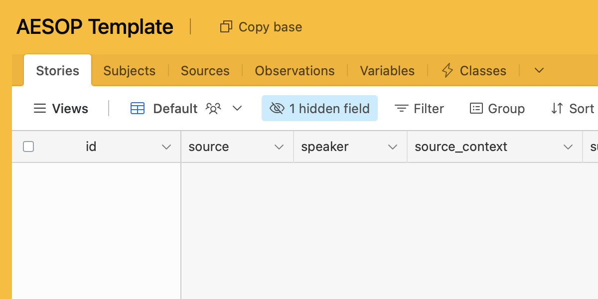
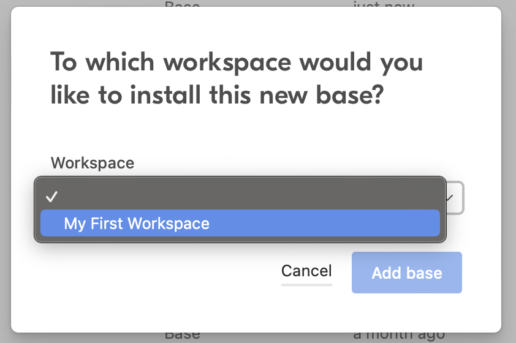
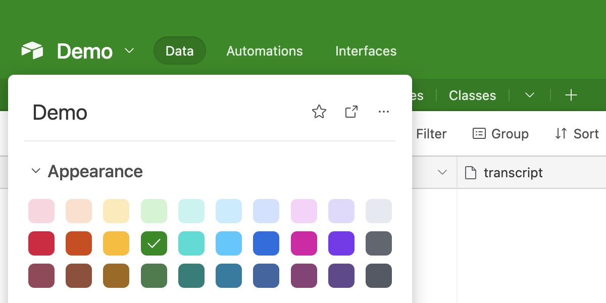
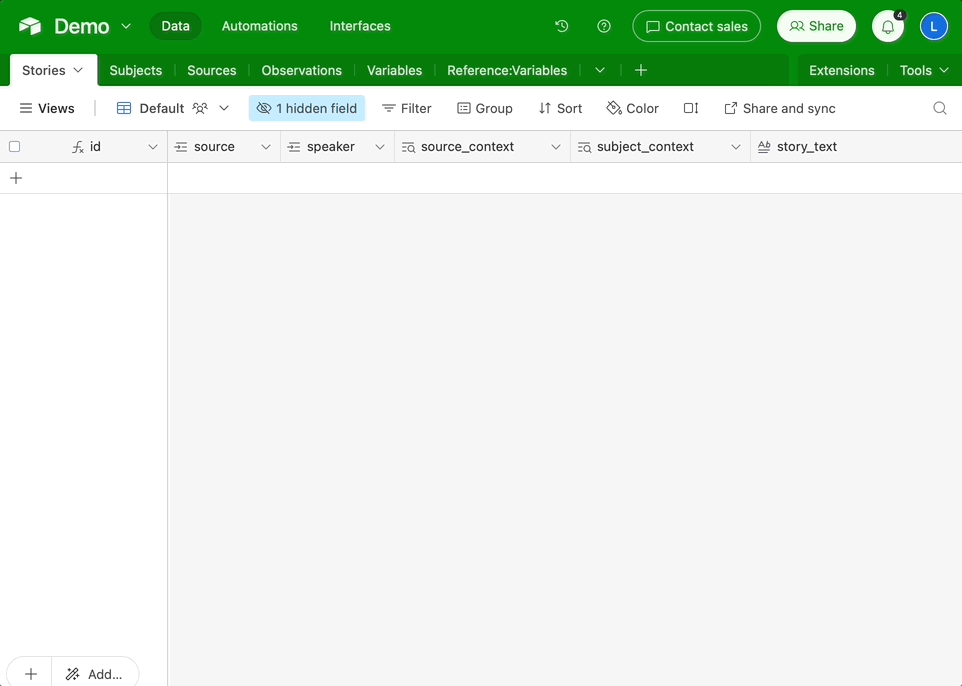

# Starting your database
:::tip TL;DR
:::
## Quickstart
### Clone the AESOP Airtable template
Open up the [AESOP Airtable template database](https://airtable.com/shrb8VUH8malSf5HQ) and click "Copy base."

You'll need to set up your own account with Airtable first.

When prompted, pick the workspace you'd like your AESOP data to reside in.

You can use the "My First Workspace" that was created by default when you made your account.

An exact copy of the AESOP template database will be placed in the workspace you selected.

Rename this to something more relevant and change the color if you'd like.

## Orientation
### Database Structure
You should now be looking at something like this:

Your database contains six linked tables. These are equivalent to the sheets in an Excel workbook or a Google Spreadsheet. The tables are structured as follows:

|Table|Type|Records|
|---|---|---|
|**Stories**|Data|Edited stories/scenes|
|**Subjects**|Metadata|Individuals/organizations/other entities appearing in the stories|
|**Sources**|Metadata|Transcripts, recordings, and other unedited sources|
|**Observations**|Analysis|Connections between variables|
|**Variables**|Analysis|Variable instances|
|**Classes**|Reference|Variable class definitions|

Only the last two tables contain any data by default. Recall from the previous section that relational databases add structure to your data by grouping related information into **records.** Each record represents a meaningful unit of information (for instance a **story,** a **subject,** or a **source**). All the information associated with a record is stored in the table's **fields.**

Spend a little time familiarizing yourself with the application. Refer back to [Airtable’s documentation](https://support.airtable.com/v1/en) whenever you hit a snag.

:::info TIP
In addition to the web browser interface, Airtable can also be accessed through native [**desktop and mobile apps.**](https://www.airtable.com/downloads) 

The desktop app may offer a slightly smoother experience for browsing and entering data than the browser version, while the mobile app can be handy for quickly checking something from a collaborator on the go.
:::

### Getting around Airtable
Here is a checklist of things you should be comfortable with before moving on:

- [Navigate the interface](https://support.airtable.com/docs/introduction-to-airtable-basics)
- [Add a new record to one of the tables](https://support.airtable.com/docs/introduction-to-airtable-basics#start-creating)
- [Expand to focus on a single record](https://support.airtable.com/docs/expanding-records)
- [Understand the different types of data field](https://support.airtable.com/docs/supported-field-types-in-airtable-overview)
- [Create and modify fields based on the attributes of your data](https://support.airtable.com/docs/field-type-overview)
- [Hide, show, reorder, and rename fields](https://support.airtable.com/docs/airtable-field-actions)
- [Filter records by field](https://support.airtable.com/docs/filtering-records-using-conditions)
- [Group records](https://support.airtable.com/docs/grouping-records-in-airtable)
- [Sort records](https://support.airtable.com/docs/sorting-records-in-airtable-views)
- [Create views to switch between different field, filter, group, and sort settings](https://support.airtable.com/docs/getting-started-with-airtable-views)
- [Undo](https://support.airtable.com/docs/airtable-keyboard-shortcuts) a mistake, use [revision history](https://support.airtable.com/docs/record-level-revision-history-overview) to review edits, and [recover](https://support.airtable.com/docs/base-trash) recently deleted records from the trash.
- [Leave a comment for a collaborator](https://support.airtable.com/docs/en/commenting-on-records-and-mentioning-collaborators)

:::info TIP
Some of the terminology in Airtable may be unfamiliar if you’ve previously only worked with spreadsheets. Airtable’s [**glossary**](https://support.airtable.com/docs/glossary-of-airtable-terminology) is a handy resource if you start feeling confused.
:::

:::tip TAKEAWAY
:::
