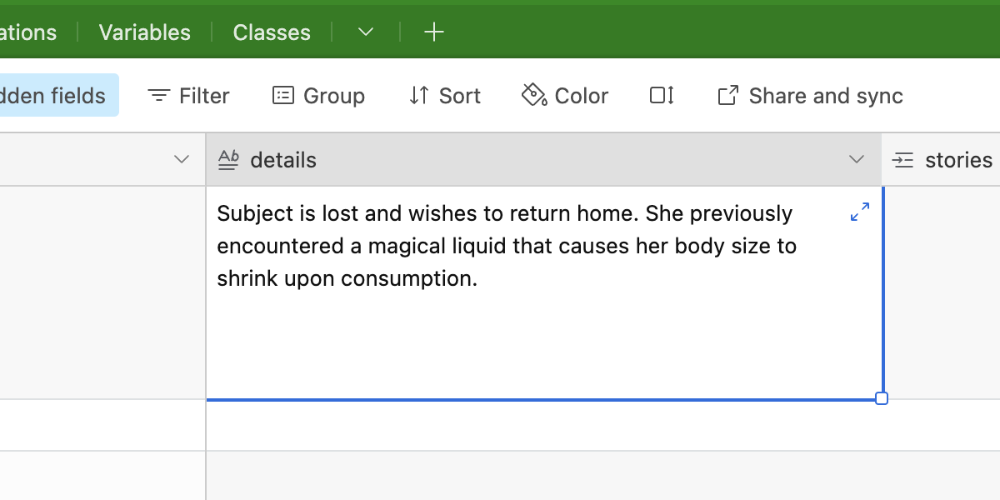

# Setting up your study
## Contextualize your sources
Enter information about your data sources in the **Sources** table. Create a separate record for each original recording/transcript you have stories for.

Depending on your research protocol and data management plan, you may wish to store your source files directly on Airtable as attachments in the **recording** and **transcript** fields. 

Alternatively, you might [convert these into text fields](https://support.airtable.com/docs/field-type-overview) to hold the file names/file paths they are saved under. 

:::caution
Avoid making major changes to the structure of your database—AESOP relies on certain features of the template database to function. 

Adding new fields and changing the type of existing ones is fine, but renaming or deleting existing fields may interfere with other programs in the workflow, and will also make it much more difficult to compare your data with others.

If you’re not using a field and want it out of the way, simply [**hide**](https://support.airtable.com/docs/airtable-field-actions#hiding-and-unhiding-fields) it from your views.
:::

Put any metadata that might help contextualize your data sources in the **details** field. For instance, you might want to write a brief note summarizing the conditions and motivation behind the study, significant recent events, high-level research questions, and any domain-specific background knowledge that someone else looking at your data might not have.

## Describe your subjects
In the **Subjects** table, create a separate record for each individual person that appears in your stories. 

Depending on the nature of your data, you may also want to add records representing other entities: groups of people, organizations, animals, even computer programs.

:::info TIP
A good rule of thumb for deciding whether to consider something a **subject** is to ask yourself whether it has **agency:** is it capable of acting in response to events or changes in its environment?

Don’t worry about getting this right on the first try—you will likely find yourself returning to this table to add more records as your analysis progresses and you re-read your stories.
:::

Similar to what you did in the **Sources** table, use the **details** field to help orient someone else to your data by providing contextual metadata. 

The structure of this table has been left deliberately loose in the template, as the sort of metadata available on subjects is likely to vary greatly from study to study.

:::info TIP
Depending on your study’s needs, you may want to group or subset your insights (e.g. by participant group, age range, geography, etc.) later on. If you anticipate needing to do this, prepare your Subjects table by doing the following:
1. [**Create separate fields**](https://support.airtable.com/docs/airtable-field-actions#adding-and-deleting-fields) to hold the different data attributes you want to segment by. 
	- If your dataset contains more than one subject type (i.e. not just individual people), it’s completely fine if not every metadata field applies to every single subject. 
2. Place any miscellaneous/unstructured context that would otherwise go under **details** in a new text field and name it something like “misc_details”
3. Convert **details** into a [**formula field**](https://support.airtable.com/docs/en/field-type-overview#field-configuration-menu) that [**joins**](https://support.airtable.com/docs/en/joining-field-values#alternative-to-concatenate) the metadata in your broken-out fields together into an easy-to-read block of text. We suggest following a format such as: `"Location: "&{location}&"\n"&"Profession: "{profession}...`, using `"\n"` for line breaks.
:::

## Enter your stories
You are now ready to start adding your edited stories to the Stories table.

:::info TIP 
Records in the Stories table are identified by a string of characters beginning with `rec`. These automatically-generated record IDs are what Airtable uses to refer to all records behind the scenes. While the Sources and Subjects tables use names for simplicity, the Stories tables uses record IDs as the primary identifier to save the trouble of having to individually name stories.
:::

Paste your edited stories/scenes as separate records in the **Stories** table.

Clicking on a cell in the **source** or **subject** fields of this table brings up a menu containing all the records of that type you previously entered. **Link** each story to the source in which it appears by selecting the appropriate record. As soon as you've linked at least one source record, the metadata in that source's **details** field will appear in the story record's **source_context** field. These records are now linked—any updates to the source will be instantly reflected in the story. You can make changes either by going back to the **Sources** table, or directly from the **Stories** table by clicking on a linked source record.

Follow the same procedure to link each **story** to the **subjects** that appear in it (you can select more than one). The "subject_context" field will be automatically populated with the corresponding subjects' metadata.

Congratulations, you're now ready to start finding patterns in your stories!

:::tip Takeaway
:::