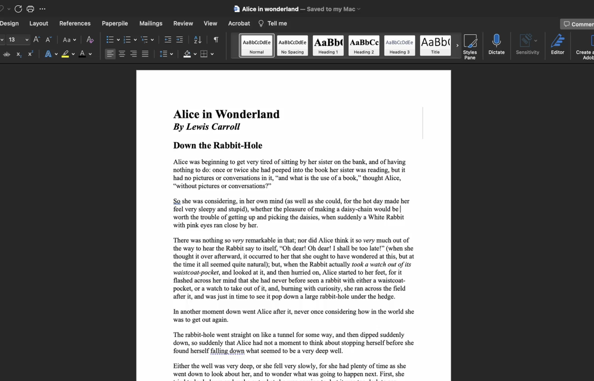
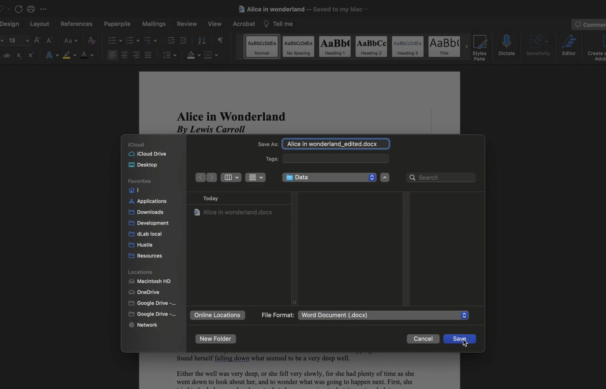
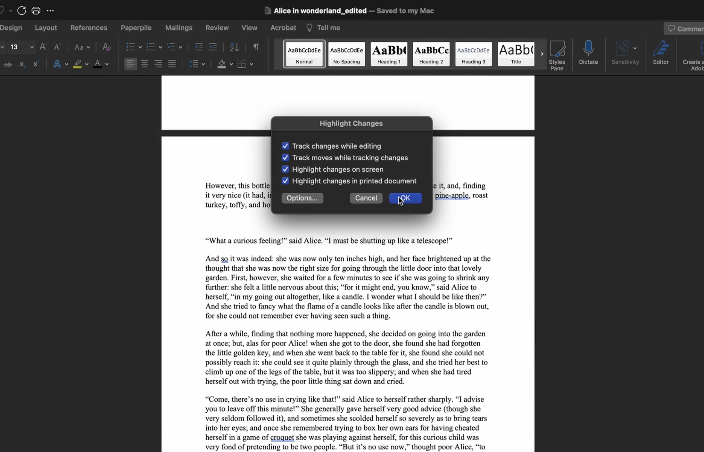
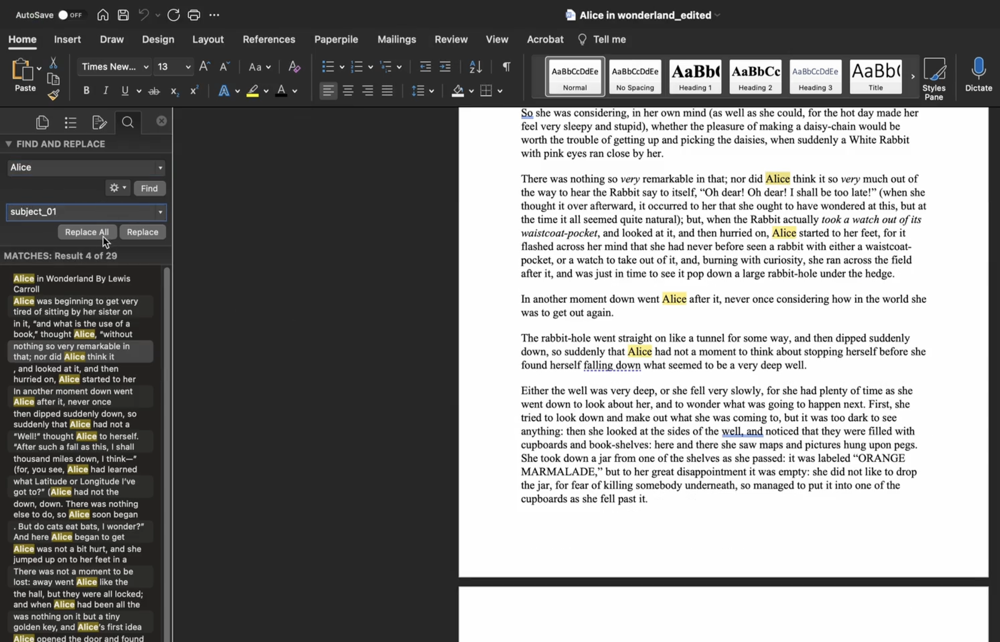
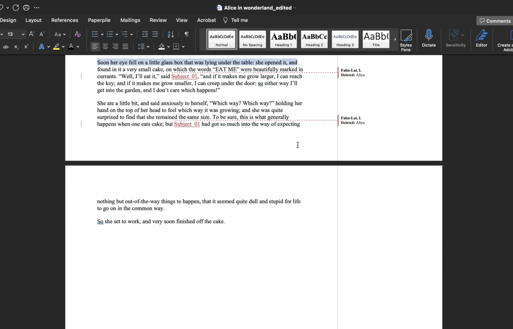
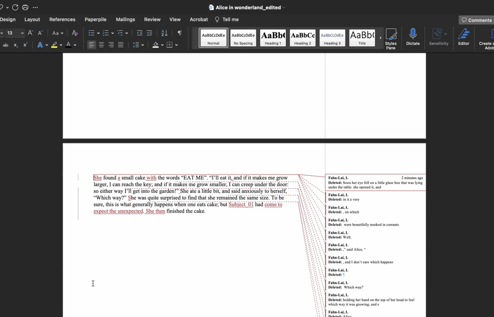
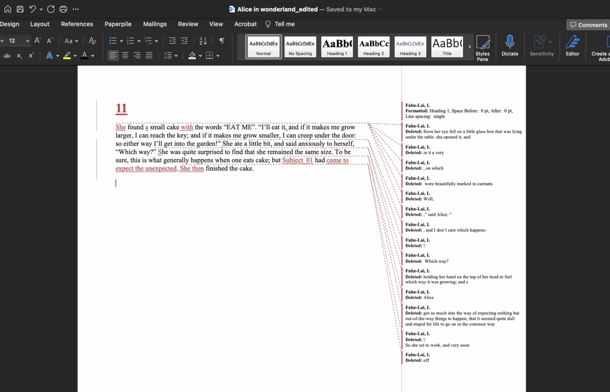

# From sources to stories
:::tip TL;DR
Raw data should be edited down into concise __stories,__ then subdivided into individual __scenes.__
:::
The first step in an AESOP analysis is to standardize, simplify, and separate our source material. We do this for two reasons:

1. A source (e.g. an interview transcript) might need to be edited for clarity, conciseness, or privacy.
2. Breaking up lengthy texts makes it easier to trace higher-level insights back to their original source.

We'll use a short excerpt from Alice in Wonderland as a stand-in for an actual interview transcript.

### Keep track of your changes
Create a duplicate of the file containing your raw data, and work exclusively in the duplicate file with change-tracking turned on.

:::caution
Never modify your actual raw data. For the sake of research integrity, make every effort to maintain an unbroken chain of evidence from raw data to conclusions drawn.
:::

The workflow shown in these screenshots is based on Microsoft Word, but similar functionality exists in Google Docs, Pages, and other word processing applications.

### Anonymize for privacy
Protect your subjects' privacy by redacting any sensitive or identifying information in accordance with your human subjects study protocol. Here, the name `Alice` is being replaced with the subject code `subject_01`

### Edit to clarify
Strive for a balance between __clarity__ and __detail__ in editing. 

On the one hand, you should simplify and paraphrase where necessary to protect the privacy and clarify the intent of the interview subjects; on the other hand, you should be wary of over-editing, since contextual details that strike you as superfluous might spark an insight from another researcher coming from a different perspective.

When in doubt, err on the side of including more detail. It is much quicker to omit context that turns out to be irrelevant down the road than it is to revisit the raw source for extra information.

:::info tip
Try to preserve the __authentic voice__ of the speaker as much as possible—you may want to justify an insight later on by presenting it in a subject's own words.
:::

Since stories might later be read outside of the context of the present interview or study, be sure to add in any __contextual particulars__ that might help a newcomer make sense of it. 

__Define uncommon terms and abbreviations__ at least once per story using parentheticals. 

If you collected your data using structured or semi-structured interviews, you might want to __incorporate parts of the interview questions/prompts__ into the story as supporting context.  

:::info tip
The __five "W"__ questions are a useful tool for thinking about how to trim unnecessary text while maintaining the overall sense of the story and preserving a useful level of detail.

__“_Who_ does _what,_ _when,_ _where,_ and _why?_”__
:::

### Split stories into scenes
Once you feel that you've simplified the text sufficiently, use numbered headings to subdivide the story into individual **scenes.** 

You can think of scenes as __mini-stories__—indeed, we will be using the terms somewhat interchangeably later in this guide. Each scene should meet the _what_ and _why_ requirements of an AESOP story, and each one should be __under 200 words__—ideally closer to __100.__ 

There are a couple of advantages to subdividing stories into scenes: it allows us to refer more precisely to specific parts of a story, and shorter chunks of text are easier to view in a variety of computer programs.

Save the raw and edited files in a secure location, and continue to the next section for instructions on how to create a database and upload your data to it.

:::tip takeaway
1. Never modify raw data; always work with __duplicate__ files and __track all changes.__
2. Stories should be __anonymized__ for privacy.
3. Stories should preserve the __voice__ of the storyteller, and contain enough __detail__ to be understood out of context.
4. Split edited stories into __100-200 word scenes.__
:::

