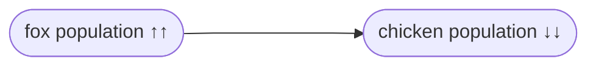

# Anatomy of an AESOP story
:::tip TL;DR
An AESOP story describes events (what) connected by cause and effect (why), which can be inferred through contextual details.
:::
## What counts as a story? 
For the purposes of AESOP, a __story__ consists of a description of __events__ and __states,__ connected by __cause and effect.__ At minimum, a story must contain the answers to two questions:
1. "What happened?"
2. "Why?"

## What: Events and States
We consider an __event__ to be __something that happens,__ whereas a __state__ is a __condition__ that is capable of __changing or varying__ over a __measurable period of time.__ 

The two concepts are intrinsically linked: events lead to changes in state, and states change from one to another by way of events. Both address the _what_ question.

This is _not_ a story:
:::note Example 1
The chicken crossed the road.
:::

Example 1 is not a __story,__ but rather a __fact.__ It describes an __event__ (crossing the road) without yielding any insight into the __mechanism(s)__ that produced it.

:::note Event Diagram 1

:::

We could also describe the event in example 1 as a change from one __state__ to another, either in terms of which side of the road the chicken is on:

:::note State Diagram 1A

:::
Or if we focus on the number of chickens on the first side of the road:
:::note State Diagram 1B

:::

In either case, we know _that_ the chicken crossed the road, but we have no idea _why._ In narrative terms, this is not a very interesting story. In AESOP terms, this is not helpful at all—there is nothing to be learned from the limited information we are given.

## Why: Cause and Effect
This _is_ a story:
:::note Example 2
The chicken crossed the road because a fox appeared on the same side.
:::
Example 2 expresses both _what_ and _why._ The conjunction `because` clearly indicates a __relationship__ between two events: a __cause__ (a fox appears) and an __effect__ (the chicken leaves).

:::note Event Diagram 2

:::
In terms of states, we can say that a change in one __variable__ (number of foxes) causes a change in another (number of chickens):

:::note State Diagram 2

:::

Causal relationships are not always this obvious. For example, these are also valid stories:
:::note Example 3
Noticing a fox nearby, the chicken crossed the road.
:::
:::note Example 4
A chicken and a fox were on the same side of the road. The chicken crossed the road.
:::

Similar to example 2, examples 3 and 4 point to one event (the appearance of a fox) as causing another (the departure of the chicken). However, the narrator does so without using explicitly causal language (e.g. `to`, `so`, `because`, `consequently`, `as a result`). The reader of the story must infer the link through syntax and context clues.

We now know that, on this side of the road at least, an increase in one __variable state__ (number of foxes) leads to a decrease in another variable (number of chickens). Going a step further, we could predict a general dynamic on the population level: __upward__ movement in the fox population drives the chicken population __downward.__

:::note Hypothesis: Variable 1 drives variable 2 in the opposite direction

:::

We have now drawn an insight out of this simple story, one that begins to describe a system of interactions. While we obviously do not know this to be true from a single account, we have now stated a __hypothesis__ that can be further explored through mathematical modeling or statistical testing, given additional data.

:::info Correlation? Causation?

AESOP regards correlation and causation as equivalent, and treats un-sourced claims from interview subjects as truths unless otherwise specified. We do this for two important reasons:

1. AESOP relies on the methodology of system dynamics. Specifically, we use causal loop diagrams (story maps) to identify how fluctuations in tangible and intangible factors influence one another to produce different  behavioral outcomes. Doing so requires us to express every observation as an interaction between an upstream and a downstream variable. AESOP analysis is therefore necessarily embedded in a causal framework, and the expectation is that any resulting insights will be validated with futher qualitative and quantitative research.

2. As a narrative-based research tool seeking to identify unifying patterns from a diverse pool of human experiences, AESOP recognizes that individual and collective behavior are informed not only by established facts and empirical knowledge, but also by subjective emotions, attitudes, and beliefs. If we notice in a transcript that a subject claims that they drink apple juice in order to avoid hair loss, the expressed belief constitutes valuable data regardless of its external validity. Whether or not apple juice is truly an effective treatment, what matters is that the subject is acting on the belief that it is true.

:::

We will return to this later, but for now it is enough to remember that:
:::tip Takeaway
1. An AESOP story must contain __cause and effect.__
2. __Contextual information__ is important for figuring out cause and effect relationships.
:::